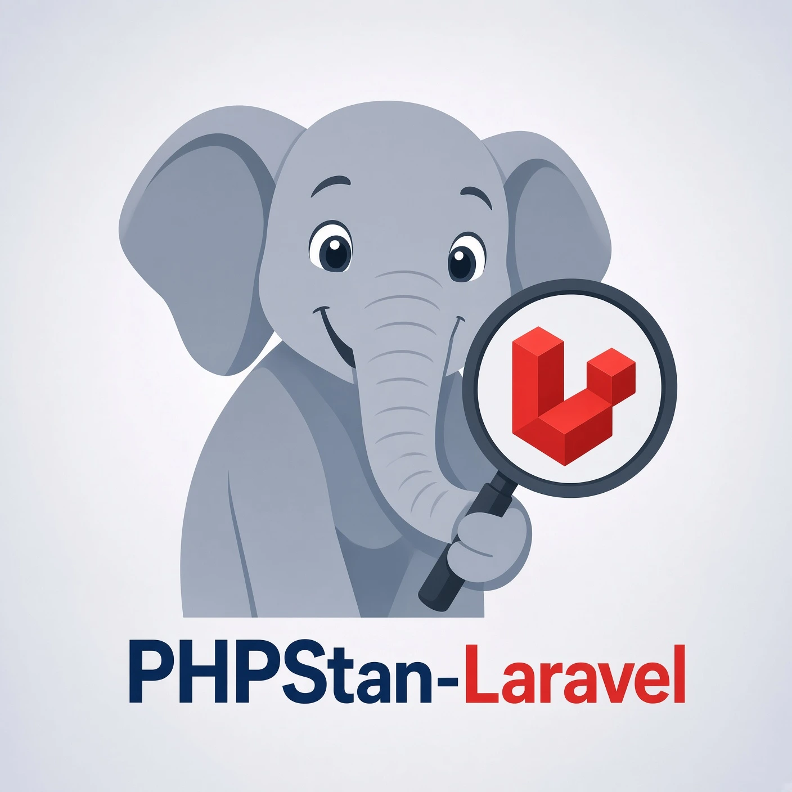

<p align="center">
  
</p>

<p align="center">
  <strong>Teaches <a href="https://phpstan.org">PHPStan</a> about <a href="https://laravel.com">Laravel</a>'s magic</strong>
</p>

<p align="center">
  <a href="https://packagist.org/packages/calebdw/phpstan-laravel"></a>
  <a href="https://packagist.org/packages/calebdw/phpstan-laravel"></a>
  <a href="https://packagist.org/packages/calebdw/phpstan-laravel"></a>
  <a href="https://github.com/laravel/boost"></a>
  <a href="https://packagist.org/packages/calebdw/phpstan-laravel"></a>
  <a href="https://github.com/calebdw/phpstan-laravel/actions/workflows/tests.yml"></a>
  <a href="LICENSE"></a>
</p>

Laravel leans on magic: facades, container bindings, dynamic Eloquent
properties, method forwarding, macros. A static analyser sees almost none of it
on its own, so the parts of your application that carry the most behaviour are
the parts it checks least.

This PHPStan extension closes that gap. It boots your application
during analysis and combines that with stubs, reflection extensions and schema
scanning, so PHPStan can reason about your models, relations, collections,
configuration and views.

```php
$user = User::query()->firstOrFail();   // App\User

$user->email;                           // string
$user->emial;                           // Access to an undefined property
$user->accounts;                        // App\AccountCollection<int, App\Account>

User::query()->pluck('name');           // Collection<int, string>
$user->accounts()->pluck('name');       // Collection<int, string>
User::all()->groupBy('email');          // Collection<string, Collection<int, App\User>>

config('auth.defaults.guard');          // string|null
Config::string('auth.defaults.guard');  // string

User::create(['emial' => '...']);       // Property 'emial' does not exist
```

None of it comes from annotations you write, and it ships rules for the mistakes
Laravel will happily let you make at runtime. It works at every PHPStan level,
on applications and on packages.

## Documentation

To get started, take a look at the [official documentation][docs]: installation,
configuration, every rule, every option and identifier, and the guide for moving
over from Larastan.

## Contributing

Contributions are welcome: see [CONTRIBUTING.md](CONTRIBUTING.md).

## Acknowledgments

This package began as a fork of [larastan/larastan][larastan], created by
[Can Vural][can] and [Nuno Maduro][nuno] and improved by many contributors over
the years. It would not exist without their work.

## License

Open-sourced software licensed under the [MIT license](LICENSE).

[larastan]: https://github.com/larastan/larastan
[can]: https://github.com/canvural
[nuno]: https://github.com/nunomaduro
[docs]: https://phpstan-laravel.dev
